# Collaborative mapping: proof from live runs

Ten real rooms, two iPhones, one Mac host. The numbers below are from last night’s `rtabmap-collab-server` log (2.38 million lines) and the current `global.db` (211 nodes). Window: **5 Sep 16:03 to 6 Sep 02:25**.

**What this proves:** tag lock is on from the first node. Ingest stays near two seconds while the map grows. Loop closures accumulate when a phone revisits. Two phones share one graph, including a measured inter-map link. The live mesh stays under 100 ms after decimation. The assembled surface textures 84% of faces (the old occlusion-on path was 44%).

| Metric | Value |
|---|---|
| Rooms with at least 10 nodes | 10 |
| Latest walk | 211 nodes in 3 min 40 s |
| Sync p50 (latest walk) | **1.92 s** |
| Loop closures (latest walk) | **35** (37 in memory at `/status`) |
| Live mesh rebuild p50 | **40 ms** |
| Bake, latest walk | **27.5 s**, **84.4%** faces textured |
| Longest single-phone walk | 415 nodes |
| Two-phone peak | 360 nodes, 130 closures |
| Tag locks / constraint rejects | 14 / 0 |

Phones: **A** = `85998EDD…`, **B** = `ED4D51E2…`.

Four 2×2 path figures of the same room 28 walk. Same X/Y limits (meters, frame G). Each sheet keeps three standard traces and changes one panel.

**Figure 1.** Panel A varies: time along the walk (navy early, ice late).

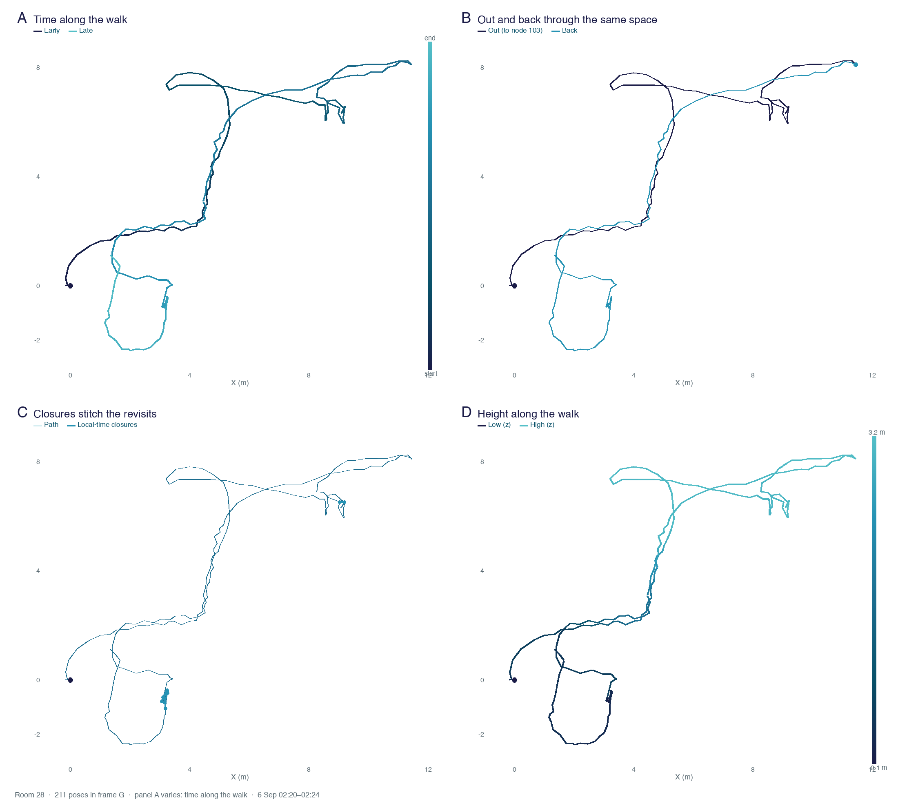

**Figure 2.** Panel B varies: three legs (start, far, return) instead of out/back.

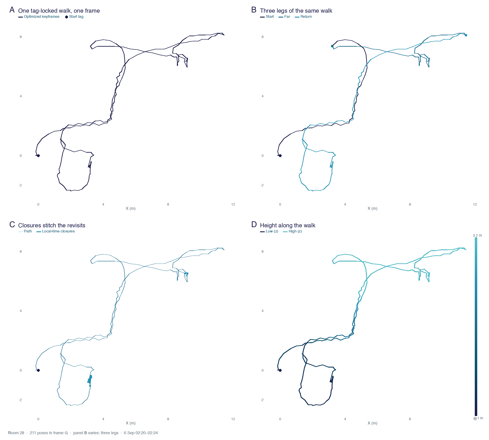

**Figure 3.** Panel C varies: near-tag closures vs far-end closures.

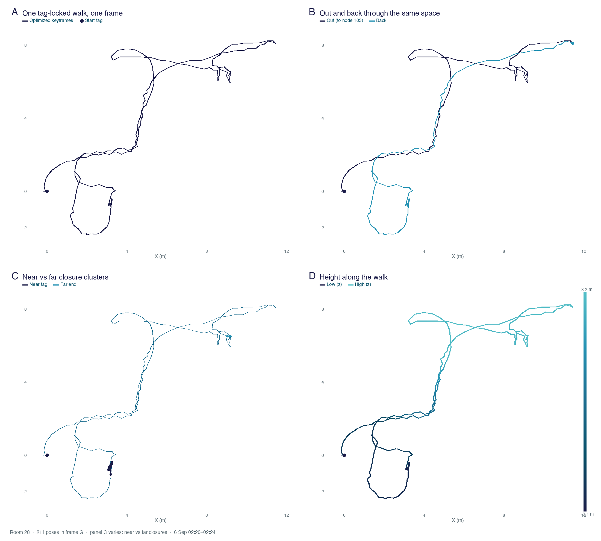

**Figure 4.** Panel D varies: step length (short navy, long ice) instead of height.

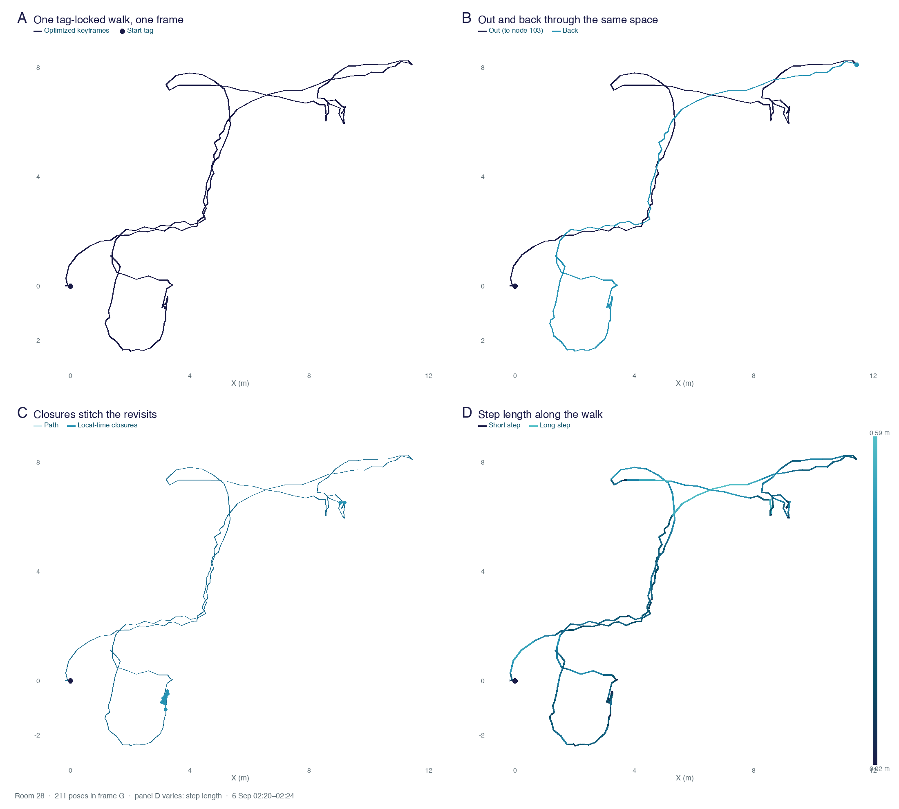

| Figure | The odd panel |
|---|---|
| **1 / A** | Color is walk time, not a single navy stroke. |
| **2 / B** | Start, far, and return instead of two colors. |
| **3 / C** | Navy chords near the tag, cyan chords at the far end. |
| **4 / D** | Color is XY step length, not height. |

---

## Latest walk (room 28)

6 Sep 02:20:18 to 02:23:59. One phone, tag locked and aligned on ingest 1. Phone path 87.6 m. Optimized graph spans **11.6 × 10.6 m**. Final bake: 89,729 verts, 108,007 faces, 4,096 atlas, 27.5 s.

### Optimized path in the shared tag frame

Top-down view of the 211 optimized keyframe poses from `global.db`. Origin is the start tag. Blue chords are stored local-time loop closures (Link type 4): the graph pulled those revisits together.

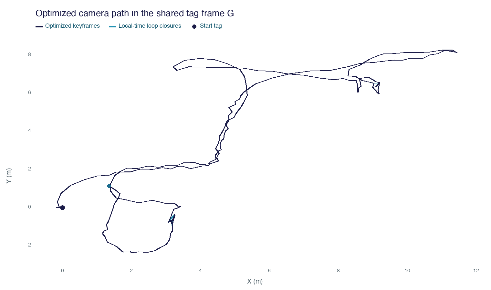

Source: `Node.pose` + `Link` · room 28 · 02:20–02:24. Axes in meters.

### Nodes and loop closures vs walk time

Closures keep rising on the way back through already-mapped space (2:20 onward).

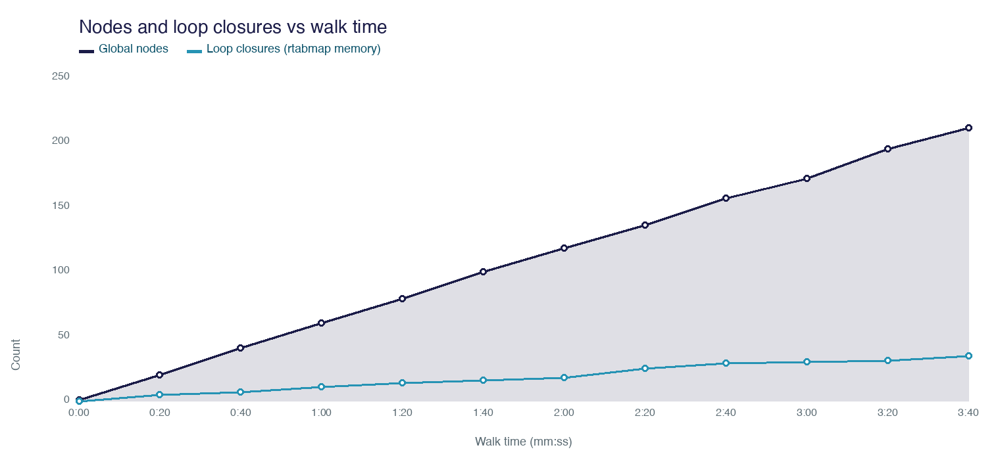

| Time | Nodes | Loop closures |
|---|---:|---:|
| 0:00 | 1 | 0 |
| 0:20 | 20 | 5 |
| 0:40 | 41 | 7 |
| 1:00 | 60 | 11 |
| 1:20 | 79 | 14 |
| 1:40 | 100 | 16 |
| 2:00 | 118 | 18 |
| 2:20 | 136 | 25 |
| 2:40 | 157 | 29 |
| 3:00 | 172 | 30 |
| 3:20 | 195 | 31 |
| 3:40 | 211 | 35 |

Source: `Ingest official DBReader+process` lines, room 28.

### POST /sync wall time vs map size

HTTP start to ingest-complete. Late spikes are larger deltas (5–10 nodes, up to 3 MB), not the graph falling over. p95 4.6 s, max 7.8 s.

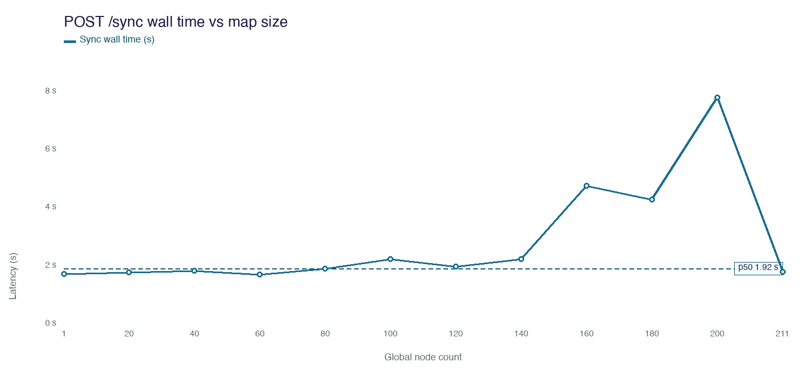

| Nodes | Sync (s) |
|---:|---:|
| 1 | 1.72 |
| 20 | 1.78 |
| 40 | 1.83 |
| 60 | 1.71 |
| 80 | 1.92 |
| 100 | 2.24 |
| 120 | 1.99 |
| 140 | 2.25 |
| 160 | 4.77 |
| 180 | 4.29 |
| 200 | 7.81 |
| 211 | 1.80 |

p50 across this walk: **1.92 s**.

### Live mesh rebuild

The 510 ms point at 124 nodes is the one-time cache rebuild when decimation steps up to stay under the 500k-face budget. After that, refresh is 20–60 ms even at 211 nodes.

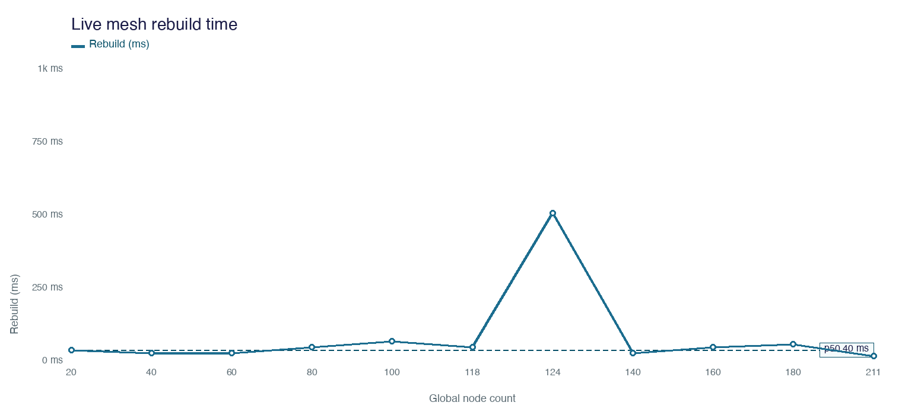

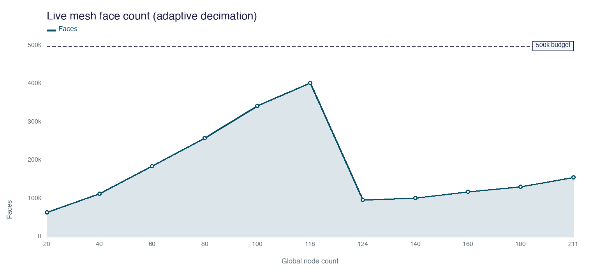

| Nodes | Rebuild (ms) | Faces |
|---:|---:|---:|
| 20 | 40 | 64,662 |
| 40 | 30 | 113,338 |
| 60 | 30 | 185,053 |
| 80 | 50 | 258,244 |
| 100 | 70 | 342,736 |
| 118 | 50 | 402,604 |
| 124 | 510 | 97,023 |
| 140 | 30 | 101,661 |
| 160 | 50 | 118,620 |
| 180 | 60 | 131,502 |
| 211 | 20 | 155,540 |

Final live mesh: 93,281 verts, 155,540 faces. Source: `Wrote live organizedFastMesh`, room 28.

### Current graph (`global.db`)

| | |
|---|---|
| Nodes / poses | 211 |
| Links | 655 |
| Neighbor | 370 (translation p50 0.26 m) |
| Neighbor-merged | 60 |
| Local-time closures stored | 14 (7 unique pairs, p50 0.49 m) |
| Landmark priors | 211 (one per node) |
| Optimized path length | 56 m |
| XY span | 11.6 × 10.6 m |

The 37-count on `/status` is rtabmap memory. It includes detections that did not all persist as type-4 links.

---

## Two phones, one graph

### Room 15: interleaved uploads

5 Sep 19:58:17 to 20:03:00. Both phones walking at once. Closures jump from 29 to 93 when the two trajectories overlap (20:00:23). Both sessions stay in one `global.db`. Finish: **360 nodes, 130 closures**.

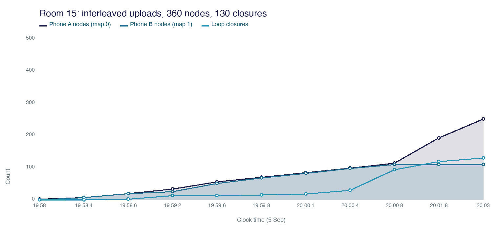

| Time | Phone A (map 0) | Phone B (map 1) | Loop closures |
|---|---:|---:|---:|
| 19:58 | 2 | 0 | 0 |
| 19:58.4 | 7 | 7 | 0 |
| 19:58.6 | 19 | 19 | 2 |
| 19:59.2 | 33 | 25 | 13 |
| 19:59.6 | 55 | 50 | 13 |
| 19:59.8 | 70 | 68 | 15 |
| 20:00.1 | 84 | 82 | 18 |
| 20:00.4 | 98 | 97 | 29 |
| 20:00.8 | 113 | 109 | 93 |
| 20:01.8 | 192 | 109 | 118 |
| 20:03 | 251 | 109 | 130 |

### Room 21: second phone joins, inter-map link stays at 1

6 Sep 00:19:19 to 00:23:59. B maps first. A joins at 00:19:47 (`aligned=1`, `tag_lock=1`). Server writes tag constraint **1 → 5** at 00:19:46 and `inter_map_lc=1`. Late dump from B at 00:23:59 adds 43 nodes onto the same connected graph.

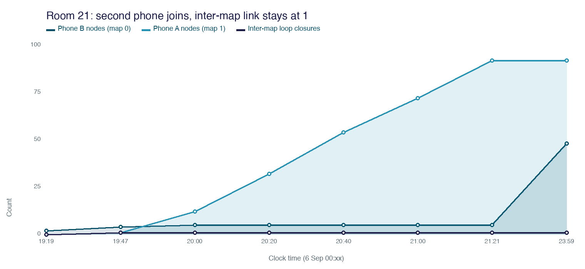

| Time | Phone B (map 0) | Phone A (map 1) | Inter-map LC |
|---|---:|---:|---:|
| 19:19 | 2 | 0 | 0 |
| 19:47 | 4 | 1 | 1 |
| 20:00 | 5 | 12 | 1 |
| 20:20 | 5 | 32 | 1 |
| 20:40 | 5 | 54 | 1 |
| 21:00 | 5 | 72 | 1 |
| 21:21 | 5 | 92 | 1 |
| 23:59 | 48 | 92 | 1 |

---

## Across the night

### Peak nodes and loop closures

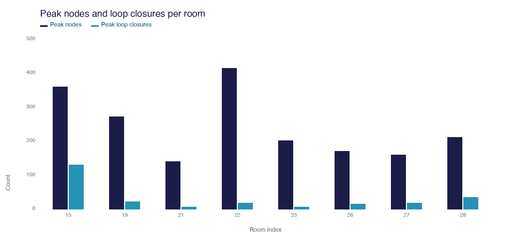

Rooms with at least 10 nodes. X axis is the room index from `Start new room` in server.log. Room 22 is the longest single-phone walk (415 nodes). Room 15 is the two-phone density win.

### Sync p50 by room

Room 15 is slower because both phones were pushing 7–24 node deltas. Single-phone walks sit on the 2 s line. 457 timed syncs overall: p50 **2.07 s**.

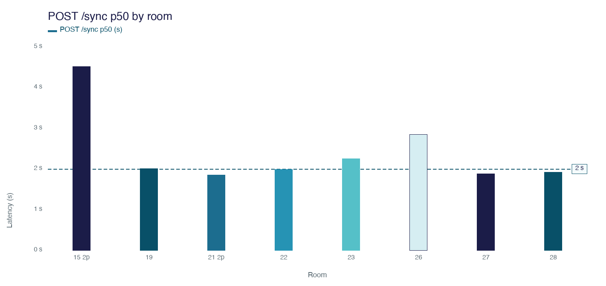

### Bake time vs coverage

Real bakes only (coverage over 50 nodes). Room 19 is the old untextured path (85–97 s). Textured bakes on later rooms land in 28–56 s except the 400-node room 22 pass (143 s).

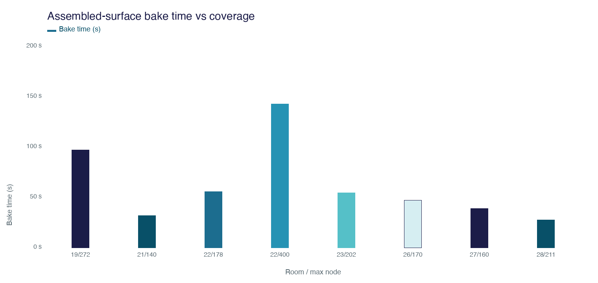

### Texture coverage

Latest walk: 109,384 of 129,604 faces (84.4%) from 211 cameras. The 44% bar is the measured occlusion-test failure on the 272-node room.

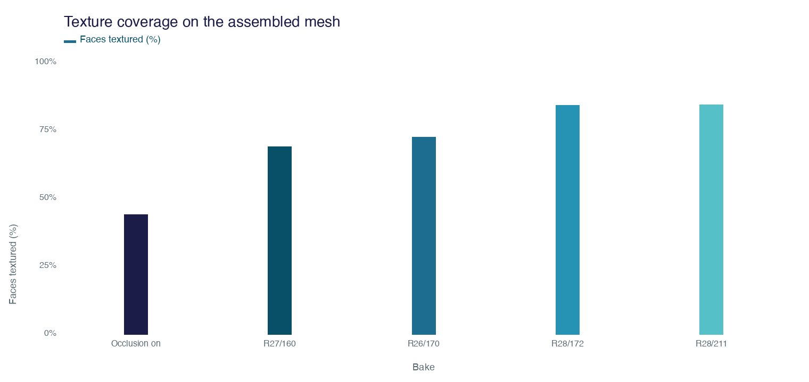

---

## Room ledger

Skipped rooms under 10 nodes and the short 24/25 restarts.

| Room | Start | Phones | Nodes | LC | Inter-map | Sync p50 | Locked |
|---|---|---:|---:|---:|---:|---:|---|
| 15 | 5 Sep 19:58 | 2 | 360 | 130 | 0 | 4.52 s | yes |
| 19 | 5 Sep 22:24 | 1 | 272 | 22 | 0 | 2.01 s | yes |
| 21 | 6 Sep 00:19 | 2 | 140 | 6 | 1 | 1.85 s | yes |
| 22 | 6 Sep 00:33 | 1 | 415 | 18 | 0 | 1.99 s | yes |
| 23 | 6 Sep 01:29 | 1 | 202 | 6 | 0 | 2.25 s | yes |
| 26 | 6 Sep 01:40 | 1 | 170 | 15 | 0 | 2.85 s | yes |
| 27 | 6 Sep 02:14 | 1 | 160 | 18 | 0 | 1.88 s | yes |
| 28 | 6 Sep 02:20 | 1 | 211 | 35 | 0 | 1.92 s | yes |

Also in the log: 1,242 `POST /calibrate`, 3,202 `GET /pull`, 2,394 `POST /heartbeat`.

---

## Sources

- `collab-data/server.log` (LaunchAgent stdout/stderr)
- `collab-data/global.db` (`Node`, `Link`)
- `collab-data/clients.json`
- `GET /status` and `GET /demo` on the live process

Charts are PNGs in `collab-run-proof/`, navy-to-ice teal on white. Send this markdown file **and** that folder (or the zip). Tables under each chart have the raw numbers if images do not load.
